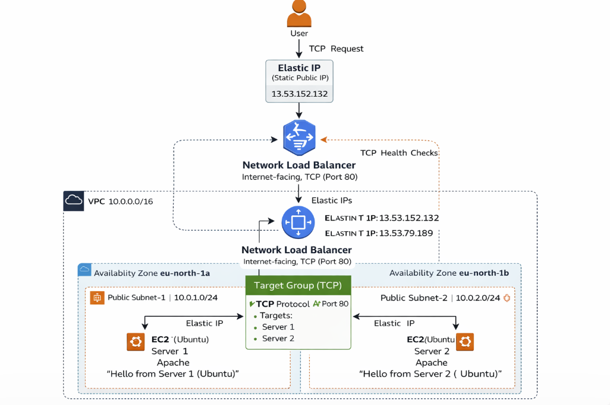
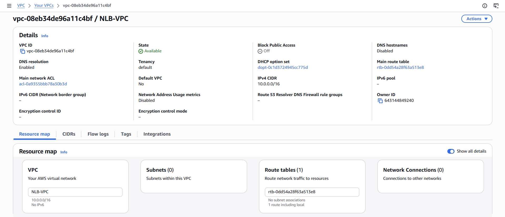
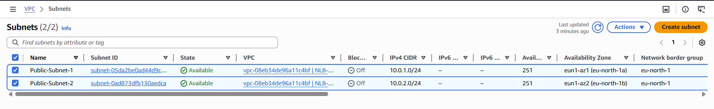
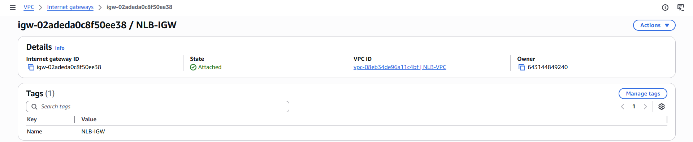
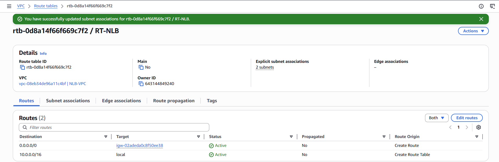
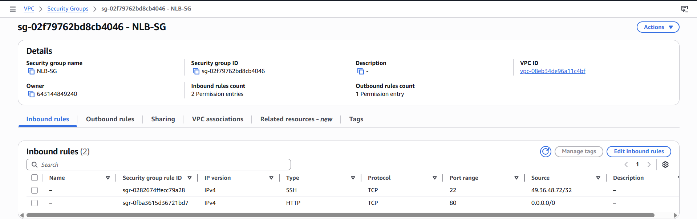

# Layer-4-Load-Balancing-using-AWS-NLB-with-TCP-and-Elastic-IP

**PROJECT OBJECTIVE :**

The objective of this project is to **design** and **implement** a **highly available** and **fault-tolerant** architecture using **AWS Network Load Balancer (NLB)** to distribute **TCP traffic** across **multiple EC2 instances** while ensuring a **static entry point using Elastic IP**.

**PROJECT OVERVIEW :**

- This project demonstrates how to build a **Layer 4 load balancing** solution using **AWS Network Load Balancer**.
- The setup includes **deploying multiple EC2 instances** in **different availability zones**, configuring a **TCP-based target group**, and assigning **Elastic IPs** to achieve a **static public endpoint**.
- The system is tested for **load distribution** and **fault tolerance** by simulating **backend server failure** and verifying **automatic traffic redirection** to **healthy instances**.

**SERVICES USED :**

- **Amazon VPC**	-                     Provides isolated network environment
- **Subnets**	-                         Distributes resources across AZs
- **Internet Gateway**	-               Enables internet access
- **Route Tables**	-                   Controls traffic flow
- **EC2 (Ubuntu)**	-                   Backend application servers
- **Security Groups**	-                 Controls inbound/outbound traffic
- **Target Group**	-                   Groups EC2 instances
- **Network Load Balancer (NLB)**	-     Distributes TCP traffic
- **Elastic IP**

**KEY FEATURES :**

- Layer 4 (TCP) Load Balancing
- Static IP using Elastic IP
- High Availability (Multi-AZ setup)
- Fault Tolerance (Automatic failover)
- Health Check Monitoring (TCP-based)
- Real-time Traffic Distribution

**REAL-WORLD APPLICATIONS :**

- **Banking Systems**
  
  -Require fixed IP for firewall whitelisting
  
  -Need zero downtime
  
- **Payment Gateways**
  
  -High traffic handling

  -Low latency communication
  
- **Gaming Servers**
  
  -Requires fast TCP connections

  -Handles large number of users
  
- **API Backends**
  
  -Microservices communication

  -High-performance traffic routing

**Architecture Diagram :**

**Architecture Flow :**

User → Elastic IP → Network Load Balancer → Target Group → EC2 Instances

**Project Flow :**

1. Created VPC and subnets
2. Launched EC2 instances
3. Installed Apache
4. Created Target Group
5. Configured NLB with Elastic IP
6. Tested load balancing
7. Simulated failure

- **Implementation Steps**

Step 1 : 

Created a **custom VPC** with **CIDR block 10.0.0.0/16** to **isolate** and **manage networking** for the **load balancing setup**.

Step 2 :

Created **two** **public subnets** across **different availability zones** to ensure **high availability** and **fault tolerance**.

Step 3 :

Created and attached an **Internet Gateway** to **enable** **internet connectivity** for resources inside the VPC.

Step 4 :

Configured **route table** to allow **internet traffic** through the **Internet Gateway**.

Step 5 :

Configured **security group** to allow **HTTP** and **SSH** access to EC2 instances.

Step 6 :

Launched **two EC2 instances** in **separate subnets** to act as **backend servers**.

- Instance / Server 1 :
  

- Instance / Server 2 :

Step 7 :

Installed **Apache web server** to handle **incoming TCP requests**.

Configured **unique responses** on **each server** to **validate load balancing**.

- Server 1 :
  

- Server 2 :

 

Step 8 :

Created **TCP-based target group** to **route traffic to EC2 instances**.

Registered **EC2 instances** into **target group**.

Step 9 :

Created **Network Load Balancer** to **distribute TCP traffic** across **servers**.

Assigned **Elastic IP** to provide **static entry point** for the application.

Connected **target group** to **load balancer**.

Step 10 :

Verified **load balancing** by **accessing application** through **NLB DNS**.

Step 11 :

Simulated **backend failure** by **stopping** the **web server** **(Server2)** on one EC2 instance. 

Observed that the **Network Load Balancer automatically** routed all incoming traffic to the **remaining healthy instance**, demonstrating **fault tolerance** and **high availability**.

- Server 2 (Stopped) :

- Verified the traffic flow :

**Project Summary :**

**This project demonstrates the implementation of a Layer 4 load balancing solution using AWS Network Load Balancer (NLB) to distribute TCP traffic across multiple EC2 instances deployed in a custom VPC (10.0.0.0/16) with subnets (10.0.1.0/24 and 10.0.2.0/24). Elastic IPs were assigned to the NLB to provide a static public entry point. The system was tested for load distribution using curl and validated for fault tolerance by simulating backend failure, where traffic was automatically redirected to the healthy instance, ensuring high availability and reliability.**

